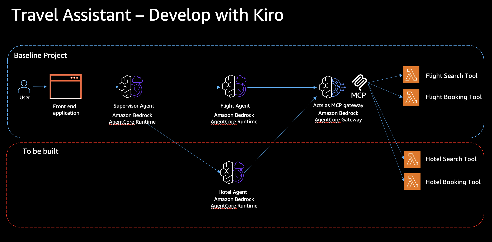

# AnyCompany AI Travel Assistant — Ubuntu Deployment Guide

Automated deployment of a travel planning multi-agent system on Amazon Bedrock AgentCore. Deploys a supervisor agent that orchestrates a flight search and booking sub-agent, backed by an MCP gateway connected to AWS Lambda functions.

> **Target OS:** Ubuntu 24.04 on AWS (kernel 6.17.0-1009-aws, x86_64)

## Architecture



## Data

Flight data is stored in `flight-data.json` — 100 sample flight records with realistic airline-route constraints:

- 10 airports: JFK, LAX, CDG, LHR, FRA, NRT, SYD, DXB, BLR, SIN
- 10 airlines, each operating only through their hub (e.g., Air India always involves BLR, Emirates always involves DXB)
- Distance-based pricing with economy always cheaper than business
- Realistic flight durations based on haversine distance

The `search_flights` Lambda loads this JSON at cold start and searches it in-memory.

## Scripts

| Script | Purpose |
|--------|---------|
| `deploy-gateway.py` | Deploys 2 Lambda functions, Cognito auth (M2M client credentials), IAM roles, and the AgentCore MCP Gateway |
| `register-target.py` | Registers `search_flights` and `book_flights` MCP tool targets against the gateway |
| `travel-assistant.py` | Deploys `flight_agent` and `supervisor_agent` to AgentCore Runtime using the Strands SDK |
| `test-client.py` | Interactive multi-turn client for testing the deployed supervisor agent |
| `cleanup.py` | Tears down all resources in dependency-aware order |
| `frontend/backend.py` | FastAPI server — serves React build and proxies `/api/chat` to the supervisor agent via SSE |
| `frontend/src/App.js` | React chat UI with streaming markdown responses and session management |
| `frontend/package.json` | React app dependencies and build scripts |

## Prerequisites

- Ubuntu 24.04 (tested on AWS EC2 with kernel 6.17.0-1009-aws)
- Python 3.12 (ships with Ubuntu 24.04)
- AWS CLI configured with credentials that have admin-level access
- `AWS_DEFAULT_REGION` set (defaults to `us-east-1`)
- Lambda zip files present in the `lambdas/` directory (included in this repo)

If you intend to deploy this workshop in your own AWS account with local Kiro installation in the laptop, then please ensure the IAM user has permissions mentioned in the section 'IAM Permissions Required by the Deploying Principal'.

### Install system packages

Ubuntu 24.04 does not ship with `pip` or `venv` by default. Install them first:

```bash
sudo apt-get update -qq
sudo apt-get install -y -qq python3-pip python3.12-venv
```

### Create a virtual environment

Ubuntu enforces PEP 668, which blocks system-wide `pip install`. You **must** use a virtual environment:

```bash
python3 -m venv .venv
source .venv/bin/activate
pip install --upgrade pip
pip install boto3 requests faker bedrock-agentcore bedrock-agentcore-starter-toolkit strands-agents strands-agents-tools
```

> **Important:** Run `source .venv/bin/activate` in every new terminal session before running any deployment script.

## Deployment Steps

Run scripts in order from the `sample-travel-assistant-workshop/` directory. Ensure the virtual environment is activated in every terminal session:

```bash
cd sample-travel-assistant-workshop
source .venv/bin/activate
export AWS_DEFAULT_REGION=us-east-1
```

### Step 1: Verify instance role permissions
```bash
python kiro-ide-instancerole-update.py
```
Finds the `kiro-ide-remote-InstanceRole-*` IAM role attached to your instance and ensures it has all permissions required by the workshop scripts (IAM, Lambda, Cognito, Bedrock AgentCore, SSM, ECR, CodeBuild, S3, CloudWatch Logs). Safe to run multiple times — skips if the policy is already attached.

> **Do not proceed** to the next steps until this reports success.

### Step 2: Deploy the MCP Gateway
```bash
python deploy-gateway.py
```
Creates:
- 2 Lambda functions (`exec_search_flights_lambda`, `exec_book_flight_lambda`) from zips in `lambdas/`
- Lambda execution IAM role (`exec_gateway_lambda_iamrole`) with `AWSLambdaBasicExecutionRole`
- Cognito user pool (`exec-agentcore-gateway-pool`), resource server, M2M client
- AgentCore MCP Gateway (`exec-TravellerAppGwforLambda`) with Cognito JWT authorizer
- Gateway IAM role (`agentcore-exec-lambdagateway-role`) with `lambda:InvokeFunction` permission

Outputs `config.json` with all resource IDs and ARNs. Cognito client credentials (client ID and secret) are stored in AWS Secrets Manager (`travel-assistant/cognito-credentials`).

### Step 3: Register MCP tool targets
```bash
python register-target.py
```
Registers 2 Lambda-backed MCP targets on the gateway:
- `search_flights` — requires `origin`, `destination`, `departure_date`; optional `seat_class` (economy/business)
- `book_flights` — stub that returns a booking confirmation

Reads gateway ID and Lambda ARNs from `config.json`.

### Step 4: Deploy agents
```bash
python travel-assistant.py
```
Creates:
- IAM roles for both agents (`agentcore-exec-flight_agent-role`, `agentcore-exec-supervisor_agent-role`)
- `flight_agent` — connects to the MCP gateway via Cognito M2M token, exposes `search_flights` and `book_flights` tools
- `supervisor_agent` — orchestrates flight_agent via `bedrock-agentcore:InvokeAgentRuntime`, reads sub-agent ARNs from SSM Parameter Store
- SSM parameters (`/agents/flight_agent_arn`, `/agents/supervisor_agent_arn`)
- ECR repositories (auto-created by starter toolkit)

Agent ARNs and role names are merged into `config.json`.

To deploy and run a smoke test:
```bash
python travel-assistant.py --test
```

### Step 5: Test the deployed agents
```bash
python test-client.py
```
Starts an interactive multi-turn conversation with the supervisor agent. Supports:
- Session persistence across turns via `runtimeSessionId`
- Type `new` to start a fresh session
- Type `quit` or `exit` to end

You can also pass an agent ARN directly:
```bash
python test-client.py --agent-arn arn:aws:bedrock-agentcore:us-east-1:123456:runtime/supervisor_agent-XXXXX
```

### Step 6: Cleanup (when done)
```bash
# Preview what will be deleted
python cleanup.py --dry-run

# Delete all resources
python cleanup.py
```
Tears down all resources in dependency-aware order:
1. AgentCore runtime endpoints → agent runtimes (supervisor first)
2. SSM parameters
3. Secrets Manager secrets (Cognito credentials)
4. Gateway targets → gateway (waits for target deletion to propagate)
5. Cognito client → resource server → domain → user pool
6. Lambda functions → Lambda IAM role
7. Agent IAM roles
8. Gateway IAM role
9. ECR repositories
10. Local files (`_agent_staging/`, `config.json`)

### Step 7: Deploy the frontend

The frontend is a React chat UI backed by a FastAPI server that proxies requests to the supervisor agent with SSE streaming. The backend reads `supervisor_agent_arn` from `config.json` (generated in Step 1/3).

First, install Node.js if not already present:
```bash
sudo apt-get install -y -qq nodejs npm
```

Then build and run:
```bash
cd frontend

# Install Python backend dependencies (venv must be active)
pip install -r requirements.txt

# Install React dependencies and build
npm install
npm run build

# Start the server (serves React build + /api/chat proxy)
python backend.py
```

Open `http://localhost:8000` in your browser. The app supports multi-turn conversations with session persistence.

To point the React dev server at a different backend (e.g., remote), set `REACT_APP_API_URL`:
```bash
REACT_APP_API_URL=http://<remote-host>:8000 npm start
```

## Agent System Prompts

The agent behavior is controlled by system prompts defined in `travel-assistant.py`:

**flight_agent** — Handles both search and booking via MCP gateway tools:
- Uses `search_flights` to find flights based on origin, destination, departure_date, and optional seat_class
- Uses `book_flights` to book flights directly (the Lambda is a no-arg stub that returns a confirmation)
- Defaults to economy class, current year next month when details are omitted

**supervisor_agent** — Orchestrates the flight agent for both search and booking:
- Delegates all flight queries and booking requests to `call_flight_agent`
- Does not fabricate flight data — always invokes the sub-agent
- Passes booking requests through to the flight agent rather than refusing them

**call_flight_agent tool** — The supervisor's only tool, described as capable of both searching and booking flights so the model routes booking intents correctly.

## Config File

All resource metadata is stored in a single `config.json`:

```
config.json
├── region
├── gateway_id, gateway_url, gateway_role_arn
├── cognito_user_pool_id, cognito_secret_name
├── cognito_discovery_url, cognito_scope_string
├── lambda_arns                          ← deploy-gateway.py
├── flight_agent_arn, supervisor_agent_arn
└── flight_role_name, supervisor_role_name  ← travel-assistant.py
```

> **Note:** Cognito client credentials (client ID and secret) are stored in AWS Secrets Manager under the secret name referenced by `cognito_secret_name`, not in `config.json`.

## AWS Resources Created

| Service | Resources | Naming Pattern |
|---------|-----------|----------------|
| Lambda | 2 functions | `exec_search_flights_lambda`, `exec_book_flight_lambda` |
| IAM | 4 roles | `agentcore-exec-*-role`, `exec_gateway_lambda_iamrole` |
| Cognito | 1 user pool, 1 resource server, 1 M2M client | `exec-agentcore-gateway-*` |
| AgentCore Gateway | 1 gateway + 2 targets | `exec-TravellerAppGwforLambda`, `exec-SearchFlightMCPTarget`, `exec-BookFlightMCPTarget` |
| AgentCore Runtime | 2 agents + 2 endpoints | `exec_flight_agent`, `exec_supervisor_agent` |
| SSM Parameter Store | 2 parameters | `/agents/flight_agent_arn`, `/agents/supervisor_agent_arn` |
| Secrets Manager | 1 secret | `travel-assistant/cognito-credentials` |
| ECR | 2 repositories | auto-created by starter toolkit |

## IAM Permissions Required by the Deploying Principal

The IAM user or role running the deployment scripts needs the following permissions:

### STS

| Action | Used By | Purpose |
|--------|---------|---------|
| `sts:GetCallerIdentity` | All scripts | Retrieve account ID |

### IAM

| Action | Used By | Purpose |
|--------|---------|---------|
| `iam:CreateRole` | `deploy-gateway.py`, `travel-assistant.py` | Create Lambda, gateway, and agent roles |
| `iam:DeleteRole` | `deploy-gateway.py`, `travel-assistant.py` | Recreate roles if they already exist |
| `iam:GetRole` | `deploy-gateway.py` | Check if roles exist |
| `iam:PutRolePolicy` | `deploy-gateway.py`, `travel-assistant.py` | Attach inline policies |
| `iam:DeleteRolePolicy` | `deploy-gateway.py`, `travel-assistant.py` | Clean up inline policies before recreation |
| `iam:AttachRolePolicy` | `deploy-gateway.py`, `travel-assistant.py` | Attach managed policies |
| `iam:DetachRolePolicy` | `travel-assistant.py` | Detach managed policies before recreation |
| `iam:ListRolePolicies` | `deploy-gateway.py`, `travel-assistant.py` | Enumerate inline policies during cleanup |
| `iam:ListAttachedRolePolicies` | `travel-assistant.py` | Enumerate managed policies during cleanup |
| `iam:PassRole` | `deploy-gateway.py`, `travel-assistant.py` | Pass roles to Lambda, Gateway, and AgentCore Runtime |

### Lambda

| Action | Used By | Purpose |
|--------|---------|---------|
| `lambda:CreateFunction` | `deploy-gateway.py` | Deploy `exec_search_flights_lambda` and `exec_book_flight_lambda` |
| `lambda:GetFunction` | `deploy-gateway.py` | Check if functions already exist |

### Amazon Cognito

| Action | Used By | Purpose |
|--------|---------|---------|
| `cognito-idp:ListUserPools` | `deploy-gateway.py` | Check for existing pool |
| `cognito-idp:CreateUserPool` | `deploy-gateway.py` | Create user pool |
| `cognito-idp:CreateUserPoolDomain` | `deploy-gateway.py` | Create Cognito domain for OAuth |
| `cognito-idp:DescribeResourceServer` | `deploy-gateway.py` | Check if resource server exists |
| `cognito-idp:CreateResourceServer` | `deploy-gateway.py` | Create resource server with gateway scopes |
| `cognito-idp:ListUserPoolClients` | `deploy-gateway.py` | Check for existing M2M client |
| `cognito-idp:DescribeUserPoolClient` | `deploy-gateway.py` | Retrieve client secret |
| `cognito-idp:CreateUserPoolClient` | `deploy-gateway.py` | Create M2M client credentials client |

### Bedrock AgentCore (Control Plane)

| Action | Used By | Purpose |
|--------|---------|---------|
| `bedrock-agentcore:CreateGateway` | `deploy-gateway.py` | Create the MCP gateway |
| `bedrock-agentcore:ListGateways` | `deploy-gateway.py` | Find existing gateway on conflict |
| `bedrock-agentcore:GetGateway` | `deploy-gateway.py` | Retrieve gateway URL |
| `bedrock-agentcore:UpdateGateway` | `deploy-gateway.py` | Update authorizer config |
| `bedrock-agentcore:CreateGatewayTarget` | `register-target.py` | Register `search_flights` and `book_flights` targets |

### Bedrock AgentCore (Runtime — via Starter Toolkit)

| Action | Used By | Purpose |
|--------|---------|---------|
| `bedrock-agentcore:*` | `travel-assistant.py` | The starter toolkit (`Runtime.launch()`) manages agent runtime creation, endpoint creation, and container builds |

### SSM Parameter Store

| Action | Used By | Purpose |
|--------|---------|---------|
| `ssm:PutParameter` | `travel-assistant.py` | Store `/agents/flight_agent_arn` and `/agents/supervisor_agent_arn` |
| `ssm:GetParameter` | `travel-assistant.py` | Read back parameter ARN for supervisor permissions |

### Secrets Manager

| Action | Used By | Purpose |
|--------|---------|---------|
| `secretsmanager:CreateSecret` | `deploy-gateway.py` | Store Cognito client credentials |
| `secretsmanager:PutSecretValue` | `deploy-gateway.py` | Update credentials if secret already exists |
| `secretsmanager:GetSecretValue` | `travel-assistant.py` | Retrieve Cognito credentials at deploy time and agent runtime |
| `secretsmanager:DeleteSecret` | `cleanup.py` | Remove secret during teardown |

### ECR (used by Starter Toolkit)

| Action | Used By | Purpose |
|--------|---------|---------|
| `ecr:CreateRepository` | `travel-assistant.py` | Auto-created by starter toolkit |
| `ecr:GetAuthorizationToken` | `travel-assistant.py` | Authenticate Docker to ECR |
| `ecr:BatchGetImage`, `ecr:PutImage`, `ecr:InitiateLayerUpload`, `ecr:UploadLayerPart`, `ecr:CompleteLayerUpload`, `ecr:BatchCheckLayerAvailability` | `travel-assistant.py` | Push agent container images |

### CloudWatch Logs (used by Starter Toolkit)

| Action | Used By | Purpose |
|--------|---------|---------|
| `logs:CreateLogGroup`, `logs:CreateLogStream`, `logs:PutLogEvents` | `travel-assistant.py` | Build and deploy logging |

### CodeBuild (used by Starter Toolkit)

| Action | Used By | Purpose |
|--------|---------|---------|
| `codebuild:*` | `travel-assistant.py` | Build agent container images |

### S3 (used by Starter Toolkit)

| Action | Used By | Purpose |
|--------|---------|---------|
| `s3:*` | `travel-assistant.py` | Stage build artifacts |

> **Note:** The `kiro-ide-instancerole-update.py` script (Step 1) attaches a policy covering all of the above to your instance role automatically.

## Troubleshooting (Ubuntu-specific)

| Issue | Fix |
|-------|-----|
| `externally-managed-environment` error from pip | You're not in the venv. Run `source .venv/bin/activate` |
| `No module named venv` | `sudo apt-get install -y python3.12-venv` |
| `pip: command not found` | `sudo apt-get install -y python3-pip` |
| `node: command not found` | `sudo apt-get install -y nodejs npm` |
## Security

See [CONTRIBUTING](CONTRIBUTING.md#security-issue-notifications) for more information.

## License

This library is licensed under the MIT-0 License. See the LICENSE file.